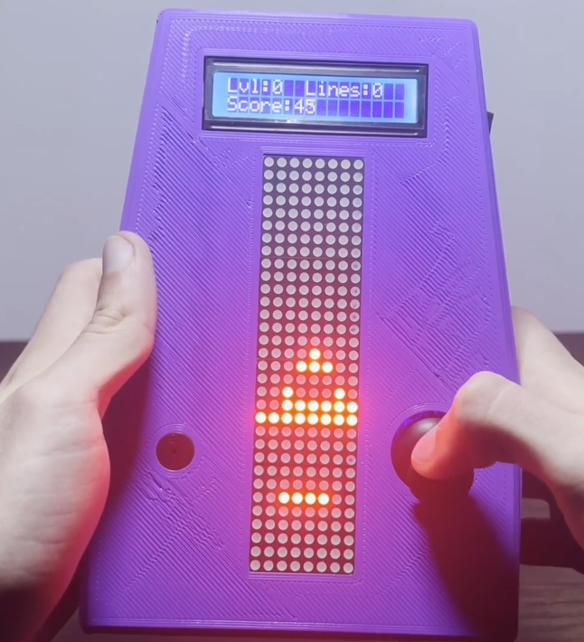

<h1 align="center">Tetris Clone</h1>

  

    <strong>A simple Tetris clone for PC and Arduino.</strong>
  

  

    
    
    
  

## Description
Tetris clone for PC made in C++ (programmed in C style) using SFML to render. Arduino version was made using MD_MAX72xx, LiquidCrystal_I2C and EEPROM libraries.

## Tetris clone for PC

    

## Tetris clone for Arduino

    

Youtube video: <a href="https://www.youtube.com/watch?v=0zau1vQD6Aw">youtube.com/watch?v=0zau1vQD6Aw</a>

## Authors

| [ @rafafelps](https://github.com/rafafelps) | [ @8LWA8](https://github.com/8LWA8) | [ @Hunter599](https://github.com/Hunter599) |
| :---: | :---: | :---: |
